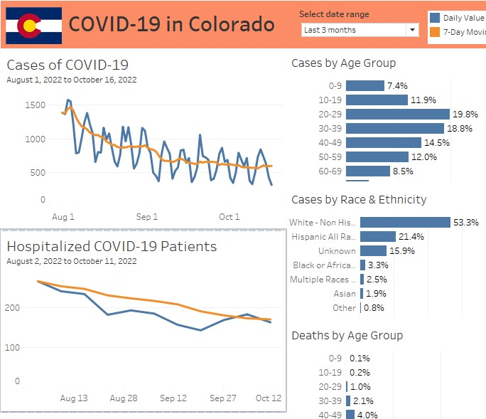

# Project: Analyzing Coronavirus Data in Colorado
## Software: Google Drive, Microsoft Excel, Google Data Studio, Tableau
## Data: Colorado Department of Public Health

### Overview: Downloaded csv files from shared Google Drive folder containing COVID-19 data. Opened files in Excel and created Power Query to clean, filter, and join data. Created data connections with Tableau and Google Data Studio for analysis and to create visualizations. For the completed dashboards, CTRL + click the links below: 

### - [Google Data Studio dashboard](https://datastudio.google.com/reporting/4449791a-985a-47b0-97fa-bce2c3dc0fbc)
### - [Tableau dashboard](https://public.tableau.com/app/profile/john.gimlin/viz/Colorado_COVID/Overview)

